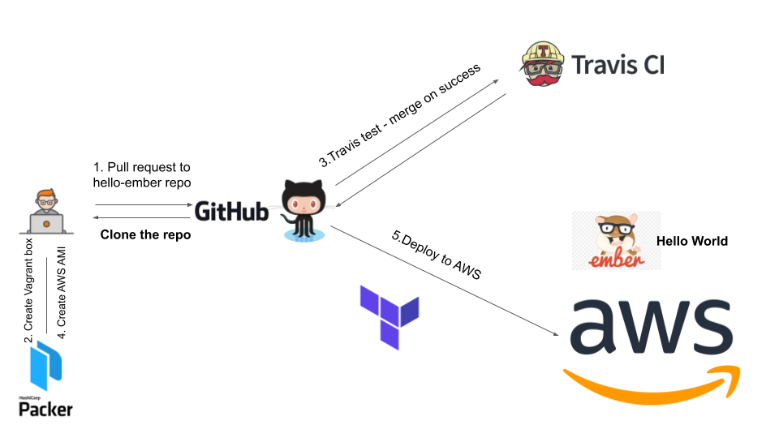

# This repo contains an Ember simple Hello World project.

## Prerequisites
- Install [Virtual box](https://www.virtualbox.org/wiki/Downloads)
- Install [Vagrant](https://www.vagrantup.com). For more information, visit [Vagrant Documentation](https://docs.vagrantup.com/v2/)
- Install [Packer](http://www.packer.io)
- Install [Terraform](https://www.terraform.io/)
## 




### How to use it
- clone the repo
```
git clone https://github.com/chavo1/hello-ember.git
cd hello-ember
vagrant up
```
